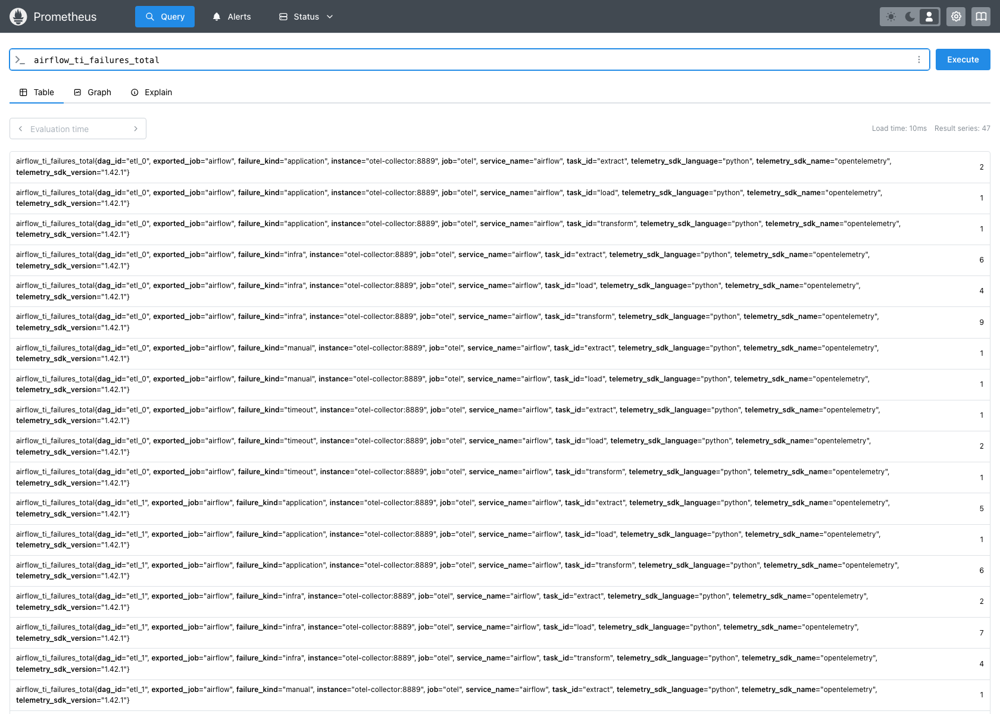
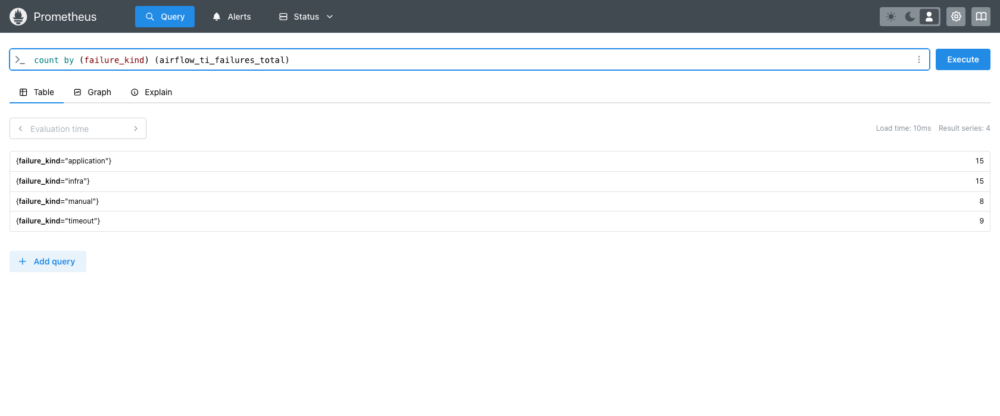
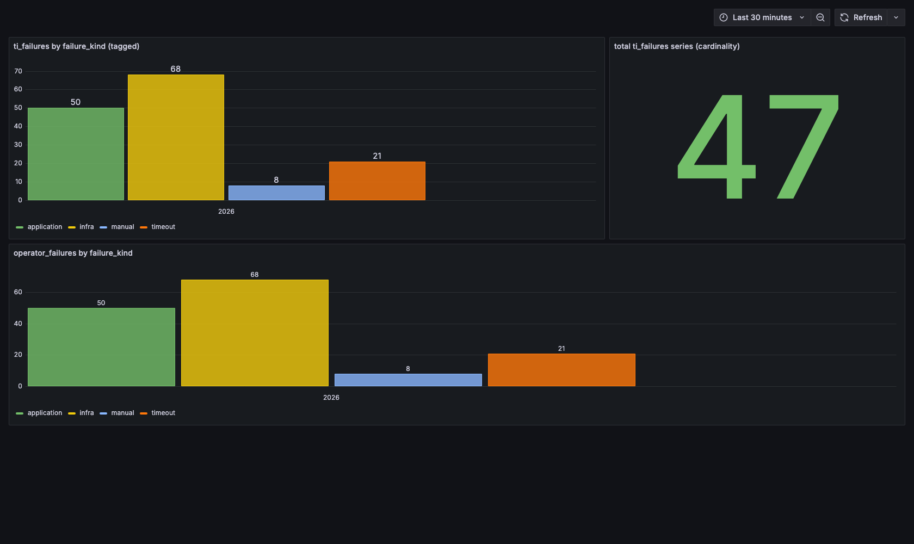

# AIP-97 metrics POC: live e2e evidence for the `failure_kind` tag

This proves the `failure_kind` metric tag end to end through a real telemetry
pipeline, and answers the cardinality question with real series counts from a
running backend.

Companion to POC [#20](https://github.com/1fanwang/airflow/pull/20) (tag
`ti_failures` / `operator_failures` with `failure_kind` at the `handle_failure`
emission site).

## Pipeline (no mocks in the path)

    Airflow OTel Stats client  ->  OpenTelemetry Collector 0.116.1
                               ->  Prometheus v3.1.0  ->  Grafana 11.4.0

Airflow config: `AIRFLOW__METRICS__OTEL_ON=True`, OTLP HTTP to the collector on
`:4318`. The collector's Prometheus exporter renames `ti_failures` to
`airflow_ti_failures_total` (dots become underscores, a `_total` suffix is
added) and keeps the labels via `resource_to_telemetry_conversion`.

## What gets emitted

The POC tags both failure counters at the emission site in `handle_failure`:

    stats.incr("ti_failures",       tags={"dag_id":…, "task_id":…, "failure_kind":…})
    stats.incr("operator_failures", tags={…, "operator_name":…, "failure_kind":…})

`failure_kind` is the bounded enum: `infra`, `application`, `timeout`, `manual`.

The live run (`emit_direct.py`) replays a realistic failure matrix, 5 DAGs by 3
tasks, each task failing a subset of kinds, through the real
`airflow.stats.Stats` OTel client with that exact tag shape.

## Cardinality: the real answer

`failure_kind` is a bounded 4-value label on a metric that only fires on
failure and is already keyed by `dag_id` and `task_id`. Adding it multiplies the
series count by at most 4, and in practice by less, because a task rarely fails
every way.

Real run: 15 base series (5 DAGs by 3 tasks) became **47 series**, below the 60
worst case, because tasks fail a subset of kinds.

    count by (failure_kind) (airflow_ti_failures_total)
      application  15
      infra        15
      manual        8
      timeout       9   = 47

This is a low-cardinality tag. High cardinality would be an unbounded label such
as a run id, a map index, or a free-text error string. A 4-value enum is exactly
what a metrics backend is built to group by.

## Screenshots

Prometheus, all 47 tagged series (`airflow_ti_failures_total`), each keyed by
`dag_id`, `task_id`, `failure_kind`:

Prometheus, series per kind (the cardinality breakdown, 15 + 15 + 8 + 9 = 47):

Grafana, failures grouped by `failure_kind`, with the total series count:

The Grafana bars separate infra churn (68 failure events) from real application
bugs (50), timeouts (21), and manual stops (8). That split is invisible today: a
single untagged `ti_failures` spike counts all four as one number.

## Honest caveat

Airflow mocks `Stats` under pytest, so the live backend numbers come from the
real OTel Stats client driven directly with the POC's tag shape, outside pytest.
The `handle_failure` to `stats.incr` wiring itself is covered by the POC's unit
test on the code branch.

## Reproduce

    docker compose up -d          # collector + prometheus + grafana
    bash run_direct.sh            # emits the matrix into the running stack
    python3 make_grafana.py       # provisions the dashboard shown above

Grafana on `:3001`, Prometheus on `:9090`, collector OTLP on `:4318`.
